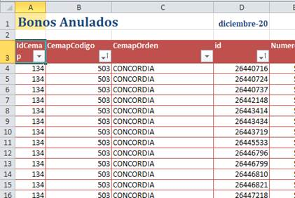

Hola a todos.

En camino de convertirse en un clásico de verano, va mi listita de apuntes (me
ausento desde el 18/1 al 7/2, me reintegro el 8/2).

Nomenclador

-   **Circuito de Actualización de nomenclador:**

    -   Las tablas que intervienen en lo que se ha denominado “Nomenclador
        Activo” de la obra social son:

        -   Tablas Presmed

        -   Tabla NOMENCLA de Unet20.Dpx

        -   Tabla PrestacionNomencladorNacional de SOMNET

    -   Desde Dirección Médica, Romina Monzón informa las actualizaciones
        requeridas al nomenclador ACTIVO.

    -   El sector Convenio realiza las altas, modificaciones o bajas en Presmed.

    -   En caso de altas o modificaciones, acceden a la opción ABM de las tablas
        del centro Autorizador de Uocranet, para trasladar descripción y nivel
        de autorización.

    -   La intervención de Sistemas es requerida para:

        -   Altas:

            -   Agregar registros en PrestacionNomencladorNacional en SomNet.

            -   Para ello armé un script que adjunto (Insert códigos en
                SOMNET.sql) que: a) ejecuta un select de los registros de
                Nomencla que faltan en PrestacionNomencladorNacional, b) en la
                columna “INSERTS” devuelve las sentencias para agregar los que
                falten, c) copio esas líneas para ejecutarlas.

        -   Bajas:

            -   En Nomencla de Dpx, modificar la descripción agregando “\* NO
                USAR \*” delante de la descripción que tenga y cambiar el nivel
                a “C”.

            -   En PrestacionNomencladorNacional, modificar Activo =0

        -   Modificaciones:

            -   En PrestacionNomencladorNacional, si fuera necesario, cambiar el
                nivel de autorización

Presmed

# *Procedimientos a demanda*

-   **Reapertura Expediente:**

    • Para Cuentas a Pagar (procedimiento original): Stored Procedure
    **UOCRA_AFILMED.Prestaci.dbo.OSP_Reapertura_Expediente (parámetro
    Nro.Expediente**)

    • Para Auditoría Médica (una instancia menos): Stored Procedure
    **UOCRA_AFILMED.Prestaci.dbo. OSP_Reapertura_AuditoriaMedica (parámetro
    Nro.Expediente)**

-   **Expedientes Liquidados:**

    -   Solicitado por Planeamiento Estratégico, Leonardo Bascietto.

    -   Stored Procedure: **EXECUTE
        UOCRA_AFILMED.Prestaci.prs_extraer_datos_expedientes_liquidados**

@prm_fecha_desde = '20200101',

@prm_fecha_hasta = '20201231',

@prm_sucur = NULL,

@prm_prestad = NULL

-   Actualiza la **dbo.OSP_ExpedientesLiquidados** con los registros del
    periodo. Ya está actualizada con los registros del 2020 (Enero-Diciembre)

-   **Informe Débitos:**

    -   Solicitado por Planeamiento Estratégico, Leonardo Bascietto.

    -   Stored Procedure: **dbo.prs_det_debitos_x_expe @prm_fecha_desde
        smalldatetime, @prm_fecha_hasta smalldatetime**

    -   Actualiza la tabla **osp_ExpedientesDebitos** con los registros del
        periodo.

    -   Eestá actualizada registros del año 2020 hasta octubre y se solicitó a
        Bascietto evaluar los resultados. No hubo respuesta

# 

# *Info general*

-   Instalación del Presmed para usuarios: ya envié mail a CAU con instructivo.

-   Alta de Usuarios en Presmed: también en un mail anterior.

-   Versión PRODUCTIVA del programa:
    [\\\\uocra_afilmed\\Prestaci\\prestaciones.exe](file:///\uocra_afilmed\Prestaci\prestaciones.exe)

-   Versión TEST del programa:
    [\\\\uocra_afilmed\\Prestaci64Bits\\prestaciones.exe](file:///\uocra_afilmed\Prestaci64Bits\prestaciones.exe)
    (actualmente equiparada a la de producción)

-   Carpeta para descarga de incidentes:
    [\\\\uocra_afilmed\\Prestaci\\Incidentes](file:///\uocra_afilmed\Prestaci\Incidentes)

    -   Conexión **ftp** con Infomedical:

        -   Servidor: 200.69.209.34

        -   Puerto: 22543

        -   usuario: uocra

        -   contraseña: Umbrella0FRUIT\_ ROPE/

    -   Descargar la carpeta remota a la carpeta local de incidentes

        -   En caso de PBDs: copiarlas en Test después de resguardar la
            anterior, probar y luego pasar a producción

        -   En caso de Stores: En Prestaci_Test, renombrar el anterior y
            ejecutar el enviado. Si funciona pasar a Prestaci.

-   Archivo seguimiento de incidentes:
    [\\\\UOCRAFS\\Ti\\Desarrollo\\AnalisisPresmed\\**IncidentesPresmed_Seguimiento2020.xlsx**](file:///\UOCRAFS\Ti\Desarrollo\AnalisisPresmed\IncidentesPresmed_Seguimiento2020.xlsx)

    -   Queda el incidente 19456 (se carga más de un expediente con un mismo
        expediente SAP) pendiente de la prueba de Cuentas a Pagar.

        -   La solución que enviaron ya instalada pero queda esperar que se
            detecte que se aplica correctamente.

-   Acceso Vpn para Infomedical (confirmar con Roby!!)

    -   Dirección VPN: [vpn.uocra.org](http://vpn.uocra.org)

        -   Puerto: 10443

        -   Usuario: infomedical

        -   Contraseña: Inf0m3dic@l

Informes varios

En general estos informes los preparo los primeros días del mes (referidos al
mes anterior, o trimestre si corresponde). Dado que me reintegro el 08/02/2021,
creo que llego a tiempo para hacerme cargo.

Pero por si acaso los requieren, o de algún periodo especial se los detallo:

# *Coordinación Administrativa*

-   Bonos Emitidos, Anulados, Producción: (describo los 3 al mismo tiempo porque
    tienen la misma modalidad)

    -   Solicitado por Coordinación Administrativa, principalmente Carlos
        Boggio.

    -   Frecuencia MENSUAL (salvo pedido extraordinario)

    -   Stored Procedures:

        -   EXEC UOCRADB1.SOMNET.goperativa.BonosAnulados_CoordAdm '20201201',
            '20201231' (@FechaDesde, @FechaHasta)

        -   EXEC UOCRADB1.SOMNET.goperativa.BonosEmitidos_CoordAdm '20201201',
            '20201231'

        -   EXEC UOCRADB1.SOMNET.goperativa.InfoProduccion_CoordAdm '20201201',
            '20201231

            En cualquiera de los 3, se lo puede ejecutar con parámetros NULL,
            NULL y se ejecutará sobre el mes anterior.

    -   Carpeta compartida del usuario: [\\\\UOCRAFS\\Coordinacion
        Administrativa\\BASES
        2020](file:///\UOCRAFS\Coordinacion%20Administrativa\BASES%202020) (dado
        el tamaño de los archivos, no conservo copia ni paso por correo, sino
        que copio en carpeta compartida)

    -   Archivos Excel:

        -   CoordAdmin_Bonos_202012_Anulados.xlsx

        -   CoordAdmin_Bonos_202012_ImportesYCodigos.xlsx

        -   InfoProduccionConsolidado_202012.xlsx

    -   Procedimiento:

        -   Abrir el archivo del mes anterior

        -   Copiar los resultados que generaron los SP en la hoja de datos, en
            la primer celda de la tabla de Excel de cada caso.

        -   

        -   Si sobran registros del mes anterior, eliminar filas (se pueden
            filtrar por las columnas Desde Hasta)

        -   Si la cantidad de registros que se copia es mayor a la que había, la
            tabla es expande automáticamente y no hay que hacer nada

        -   Para actualizar las tablas dinámicas dependientes de la tabla de
            datos, posicionándose en una celda de la tabla, ejecutar de la
            pestaña Diseño- Actualizar Todo.

        -   

        -   Guardar como “nombre del archivo”+periodo…

        -   Salvo omisión en los archivos incluyo una hoja “select” o “script”
            con la llamada o script que genera el informe

# *Dirección Médica – Trimestrales*

>   Ya fueron entregados los correspondientes al último trimestre 2020, por lo
>   que no deberían solicitar nada al respecto. Pero a provecho a documentar la
>   generación de los mismos.

-   Resolución 650 - Certificados DBT, TRIMESTRAL:

    -   Stored procedure: EXEC UOCRADB1.SOMNET.goperativa.CertifVigentesyCiap
        '2020-10-01', '2020-12-31'

        -   Archivo: VSalar_CertifCiapDBT_202010_202012.xlsx

        -   Procedimiento para copiar resultado similar a los informes para
            Coord. Administrativa

-   Aplicativo Resolución 331, TRIMESTRAL:

    -   Stored procedure: EXEC UOCRA_DW1.APS.dbo.Aplicativo331_OK '2020-10-01',
        '2020-12-31'

        -   Resultados: El store genera 3 resultset

            1.  Copiar columna Registro a un archivo texto plano
                BENEF_202010_202012.TXT

            2.  Copiar columna Registro a un archivo texto plano
                PATOLOG_202010_202012.TXT

            3.  Copiar todo el resultset a la hoja Resultados (primera celda de
                la tabla de datos) del archivo InfoAplic331_202010_202012.xlsx

            4.  Si quedan registros del periodo anterior (filtrar por columna
                Desde o Hasta), eliminarlos.

            5.  Actualizar TODO

        -   Procedimiento para copiar resultado similar a los informes para
            Coord. Administrativa

# *M. Lalin - Diabetes*

-   Información sobre certificados de DBT y expedientes de medicamentos de DBT

    -   Solicitado por Maximiliano Lalin

    -   Frecuencia MENSUAL (salvo pedido extraordinario)

    -   Stored Procedures:

        -   EXEC UOCRADB1.SOMNET. goperativa.MLalin_CertifExpedDBTMes '202012'
            (mes a procesar)

        -   Genera dos resultset sobre Certificados y expedientes de
            medicamentos.

    -   Carpeta compartida del usuario: [\\\\UOCRAFS\\Direccion de
        prestaciones\\MLALIN\\](file:///\\UOCRAFS\\Direccion%20de%20prestaciones\\MLALIN)
        (dado el tamaño de los archivos, no conservo copia ni paso por correo,
        sino que copio en carpeta compartida)

    -   Archivos Excel: MLalin_Certif_Medica_202011ConObraSocial.xlsx

    -   Procedimiento: Similar a los informes de Coordinación

        -   Abrir el archivo del mes anterior

        -   Copiar el primer resultset en hoja Certificados y el segundo en
            ExpedientesSA (en cada tabla de datos de Excel).

        -   Si sobran registros del mes anterior, eliminar filas (se pueden
            filtrar por las columnas Desde Hasta)

        -   Actualizar las tablas dinámicas dependientes, posicionándose en una
            celda de una de las tabla de datos, ejecutando de la pestaña Diseño-
            Actualizar Todo.

        -   Guardar como “nombre del archivo”+periodo…

-   [\\\\UOCRAFS\\Direccion](file:///\UOCRAFS\Direccion) de
    prestaciones\\MLALIN\\MLalin_CertifNoRenovados.xlsx

    -   En la hoja “script” se encuentra el texto del script que genera el
        informe
