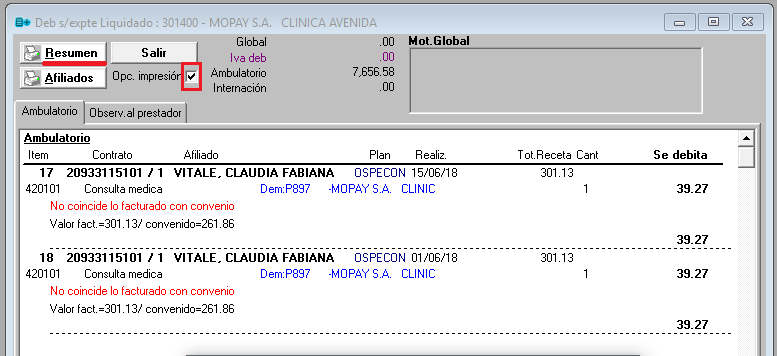
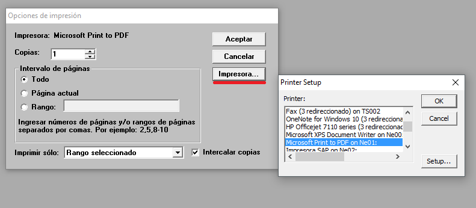

**GENERACION DE ARCHIVO EN FORMATO PDF – Presmed**

Una vez abierto el detalle de un debito en -\> Consulta por expediente deben
tildar la opción “Opc. Impresión” y luego hacer click en el botón “Resumen”

Se les va abrir la opción que usan para imprimir, pero deben hacer click en
“Impresora…” y seleccionar la opción “Microsoft Print to PDF on Ne01:” y luego
“OK”.

En las opciones de impresión va a cambiar la Impresora y al hacer click en
aceptar, en vez de imprimir, va a abrir el explorador de archivos para guardar
el documento.

