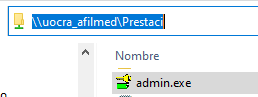
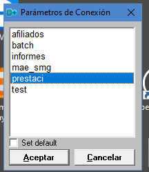
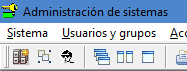
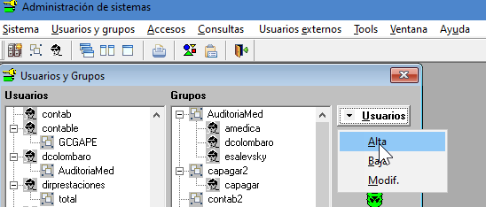
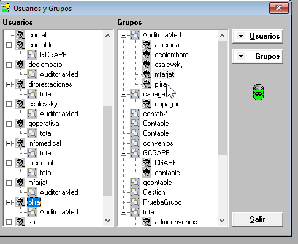
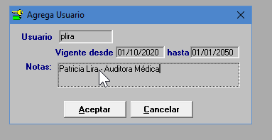
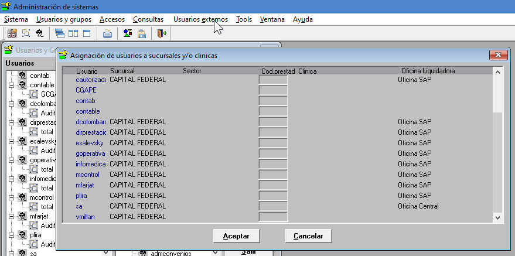
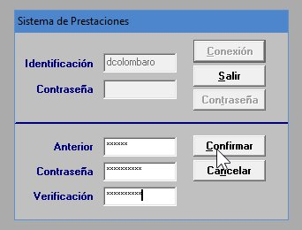

PRESMED - Alta de Usuario para Grupo (perfil) existente

-   Ingresar la programa **Admin.exe** de la carpeta
    [\\\\UOCRA_AFILMED\\Prestaci](file:///\\UOCRA_AFILMED\Prestaci)

-   Indicar la base de datos Prestaci (productivo) al ingresar.

-   Ingresar a la opción de menú **Usuarios y grupos**

-   Botón **Usuarios**, opción **Alta**

-   Ingresar los datos del usuario. Se creará con la contraseña inicial
    **“inicio”**

-   Asignar el nuevo usuario a uno de los grupos existentes en el panel derecho,
    arrastrando el usuario desde el panel izquierdo

## Otros parámetros:

-   Ingresar a la opción de menú **Usuarios externos** para completar la
    parametrización del usuario.

-   Buscar el usuario en la lista y **agregarle “CAPITAL FEDERAL” en Sucursal y
    “Oficina SAP” en Oficina Liquidadora**

0
## **Cambio de Contraseña** #

-   Las contraseñas pueden ser modificadas por el usuario al momento de
    ingresar, con el botón “Contraseña”.

-   Debe ingresar la contraseña actual y luego ingresar la nueva contraseña y su
    verificación.

