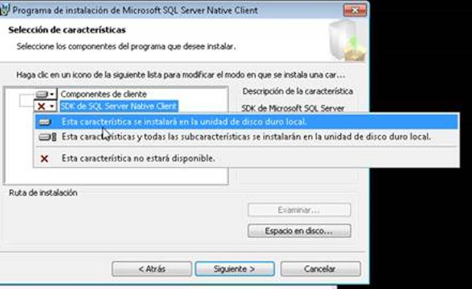
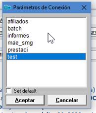
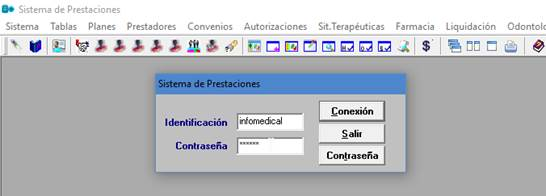
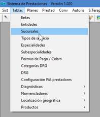
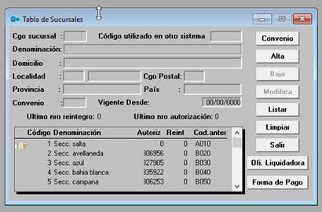

# PRESMED - Configuración de equipos de cliente Versión PB12

-   Instalar el complemento SQL Client (si hace falta)

    -   Carpeta actual de los instaladores:
        [**\\\\UOCRA_AFILMED\\Prestaci64bits\\InstaladoresSQLClient**](file:///\\UOCRA_AFILMED\Prestaci64bits\InstaladoresSQLClient)

        -   **Para 32bits, instalar sqlcli.msi**

            -   Para 64bits, instalar **sqlcli_x64_2000.msi**

    -   **Seleccionar la opción: SDK de SQL Server Native Client –\> Esta
        características se instalarán en la unidad de disco duro local.**

    -   ****

-   Copiar NUEVO archivo de conexión **conexion.ini**

    -   De donde sacarlo:
        [**\\\\UOCRA_AFILMED\\Prestaci64bits\\InstaladoresSQLClient\\Archivo_conexion_NuevaVersion**](file:///\\UOCRA_AFILMED\Prestaci64bits\InstaladoresSQLClient\Archivo_conexion_NuevaVersion)

    -   Para 32 bits en **C:\\Windows.**

    -   Para 64 bits en
        **C:\\Users\\%usuario%\\AppData\\Local\\VirtualStore\\Windows** (Si la
        carpeta no existe, crearla).

    -   En todos los casos: renombrar archivo conexion.ini anterior y establecer
        **permisos de SOLO LECTURA** sobre el archivo copiado

-   Confirmar acceso al programa:

    -   Acceso directo en escritorio de usuario a
        [\\\\UOCRA_AFILMED\\Prestaci\\prestaciones.exe](file:///\\UOCRA_AFILMED\Prestaci\prestaciones.exe)

        (El **mismo que la versión anterior**, porque vamos a mover el nuevo
        ejecutable a la misma carpeta)

    -   Probar acceso al programa y datos:

        -   Utilizar el acceso directo

        -   Cuando abra la ventanita de Parámetros de conexión , seleccionar
            base de datos: test (prestaci va a estar en migración)

        -   

        -   **Usuario: infomedical Contraseña: acceso**

        -   

        -   Probar ingresar a la opción Tablas-Sucursales:

        -   

        -   

    -   Si llegamos a esta punto… Hiupiii!

-   De ser posible, que queden algunos equipos sin apagar y tomar nota de las
    IP, así puedo probarlo remotamente cuando termine la migración.
